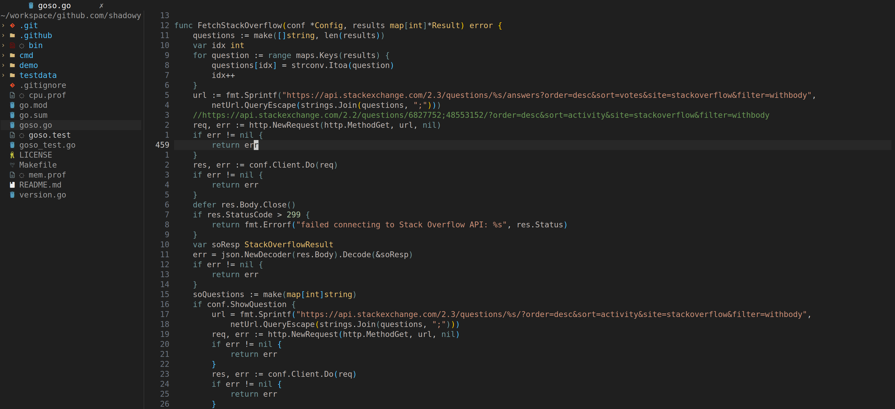

<div align="center">

# VsCode-Gruber.nvim

An attempt to combine the VSCode Dark Modern theme with Gruber Darker theme



</div>

## Installation

### [vim-plug](https://github.com/junegunn/vim-plug)

```vim
Plug 'rktjmp/lush.nvim'
Plug 'shadowy-pycoder/vscode-gruber.nvim', { 'branch': 'main' }
```

### [lazy.nvim](https://github.com/folke/lazy.nvim)

```lua
return {
  'shadowy-pycoder/vscode-gruber.nvim',
  dependencies = { 'rktjmp/lush.nvim' },
  name = 'vscode-gruber',
  branch = 'main',
  priority = 1000,
  config = function()
    vim.cmd('colorscheme vscode-gruber')
  end,
}
```
